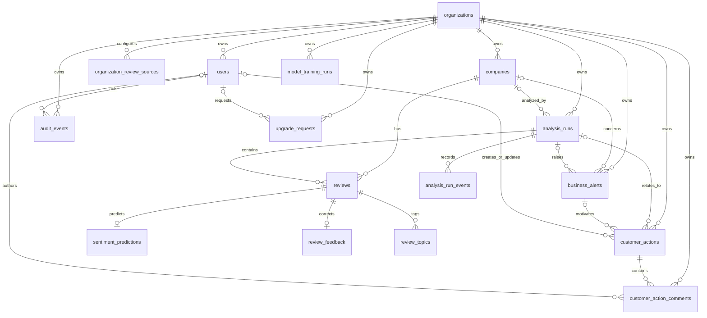
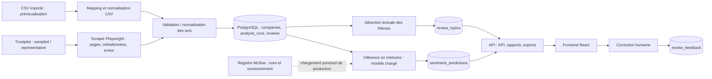

# Schéma de données et pipeline ETL — Satisfaction Client

État du code au 24 septembre 2026. Source de vérité du schéma produit : huit migrations Alembic `20260705_0001` à `20260921_0008` dans [`migrations/versions/`](../migrations/versions/). Il n'existe pas de classes de modèles SQLAlchemy déclaratifs : l'API utilise des requêtes SQL et [`app/api/database.py`](../app/api/database.py) valide le schéma attendu. Les tables historiques d'[`init_db.sql`](../init_db.sql) sont distinctes du schéma produit.

## Architecture et conventions

Le produit reçoit soit des avis Trustpilot via [`app/scraper.py`](../app/scraper.py), soit un CSV importé. [`analysis_service.py`](../app/api/services/analysis_service.py) normalise puis persiste entreprises, analyses et avis dans PostgreSQL. Le sentiment est inféré par [`app/sentiment_analysis.py`](../app/sentiment_analysis.py) avec un modèle chargé en mémoire depuis l'alias MLflow `production` au démarrage ou lors d'un rechargement. MLflow sert au suivi, au registre et au chargement du modèle ; chaque avis ne traverse pas le serveur MLflow. Si ce chargement échoue, le code prévoit un repli TextBlob. Des thèmes lexicaux, agrégats et exports alimentent l'API FastAPI et le frontend React. Celery exécute l'analyse ; Redis sert de broker. Les migrations créent **16 tables produit**. `INT`, `BIGINT`, `VARCHAR(n)`, `TEXT`, `BOOL`, `FLOAT`, `DATE`, `TIMESTAMP`, `JSON` et `JSONB` reprennent les types déclarés dans les migrations ; `PK` = clé primaire, `FK` = clé étrangère, `NN` = non nul. Sauf mention contraire, les colonnes sont nullable ; les dates/heures sont des `TIMESTAMP` sans fuseau explicite. Les `INT PK` ne sont pas présentés comme des UUID.

La notation `o|` indique une relation facultative. Une ligne enfant dont la FK est non nulle appartient exactement à un parent ; une FK nullable permet zéro ou un parent. Le diagramme représente les FK réelles, pas des contraintes transversales supposées. Les deux rôles utilisateur créateur/modificateur de `customer_actions` sont détaillés ci-dessous.

## Catalogue complet des tables produit

Les colonnes sont listées sous la forme `nom TYPE` ; les attributs `PK`, `FK`, `NN` et les valeurs par défaut significatives suivent entre parenthèses. Les index de PK et d'unicité sont implicites, en plus des index nommés indiqués.

### Identité et configuration

| Table | Colonnes réellement déclarées | Contraintes et index pertinents |
| --- | --- | --- |
| `organizations` | `organization_id INT (PK)`, `name VARCHAR(255) (NN)`, `slug VARCHAR(255) (NN)`, `default_source VARCHAR(50) (NN, 'trustpilot')`, `default_pages_per_star INT (NN, 1)`, `created_at TIMESTAMP`, `updated_at TIMESTAMP`, `plan VARCHAR(40) (NN, 'business')`, `plan_updated_at TIMESTAMP` | `slug` unique ; `idx_organizations_plan(plan)`. |
| `organization_review_sources` | `organization_id INT (PK, FK, NN)`, `source_id VARCHAR(80) (PK, NN)`, `is_enabled BOOL (NN, false)`, `is_configured BOOL (NN, false)`, `status VARCHAR(30) (NN, 'not_configured')`, `config JSONB (NN, {})`, `last_error TEXT`, `created_at TIMESTAMP`, `updated_at TIMESTAMP` | FK `organization_id → organizations` `CASCADE` ; PK composée `(organization_id, source_id)` ; `idx_org_review_sources_status(organization_id,status)`. La présence d'une configuration ne prouve pas qu'un connecteur est opérationnel. |
| `users` | `user_id INT (PK)`, `organization_id INT (FK, NN)`, `email VARCHAR(255) (NN)`, `full_name VARCHAR(255)`, `password_hash TEXT (NN)`, `role VARCHAR(50) (NN, 'member')`, `is_active BOOL (NN, true)`, `account_status VARCHAR(30) (NN, 'active')`, `invitation_token TEXT`, `invitation_expires_at TIMESTAMP`, `invited_at TIMESTAMP`, `activated_at TIMESTAMP`, `created_at TIMESTAMP`, `updated_at TIMESTAMP` | FK organisation `CASCADE` ; `email` et `invitation_token` uniques ; `idx_users_org(organization_id)` et index partiel sur `invitation_token IS NOT NULL`. |
| `upgrade_requests` | `upgrade_request_id INT (PK)`, `organization_id INT (FK, NN)`, `requested_by_user_id INT (FK)`, `requested_by_email VARCHAR(255)`, `current_plan VARCHAR(40) (NN)`, `requested_plan VARCHAR(40) (NN)`, `status VARCHAR(40) (NN, 'pending')`, `source VARCHAR(80)`, `note TEXT`, `metadata JSON (NN, {})`, `created_at TIMESTAMP`, `updated_at TIMESTAMP`, `handled_at TIMESTAMP` | Organisation `CASCADE`, utilisateur `SET NULL` ; index `(organization_id,status)` et unicité partielle `(organization_id,requested_plan,status)` pour statuts `pending`/`approved`. |

### Entreprises, analyses et avis

| Table | Colonnes réellement déclarées | Contraintes et index pertinents |
| --- | --- | --- |
| `companies` | `company_id INT (PK)`, `organization_id INT (FK, NN)`, `company_name VARCHAR(255) (NN)`, `trustpilot_slug VARCHAR(255) (NN)`, `source_url TEXT`, `created_at TIMESTAMP`, `updated_at TIMESTAMP`, `domain VARCHAR(100)`, `trustscore FLOAT`, `total_review_count BIGINT`, `rating_distribution JSONB`, `metadata_collected_at TIMESTAMP` | Organisation `CASCADE` ; index unique `(organization_id,trustpilot_slug)`. Les cinq derniers champs viennent de `0007`. |
| `analysis_runs` | `run_id INT (PK)`, `company_id INT (FK)`, `organization_id INT (FK, NN)`, `source VARCHAR(50) (NN, 'trustpilot')`, `status VARCHAR(30) (NN, 'pending')`, `stars_requested TEXT`, `pages_per_star INT (NN, 1)`, `total_reviews INT (0)`, `reviews_json_path TEXT`, `predictions_csv_path TEXT`, `celery_task_id TEXT`, `model_uri TEXT`, `error_message TEXT`, `started_at TIMESTAMP`, `finished_at TIMESTAMP`, `created_at TIMESTAMP`, `updated_at TIMESTAMP`, `collection_mode VARCHAR(30) (NN, 'sampled')`, `max_pages INT`, `pages_requested INT`, `pages_processed INT (NN, 0)`, `pages_succeeded INT (NN, 0)`, `pages_failed INT (NN, 0)`, `reviews_extracted INT (NN, 0)`, `unique_reviews INT (NN, 0)`, `stop_reason VARCHAR(50)` | `company_id → companies` et `organization_id → organizations`, tous deux `CASCADE` ; index séparés entreprise et organisation. Champs de collecte ajoutés en `0007`. FK `company_id` conservée par `0008`. |
| `analysis_run_events` | `event_id INT (PK)`, `run_id INT (FK, NN)`, `level VARCHAR(20) (NN, 'info')`, `step VARCHAR(80)`, `message TEXT (NN)`, `created_at TIMESTAMP` | Run `CASCADE` ; index `(run_id)`. |
| `reviews` | `review_id INT (PK)`, `run_id INT (FK, NN)`, `company_id INT (FK, NN)`, `external_review_key TEXT (NN)`, `author_name VARCHAR(150)`, `rating INT`, `raw_date TEXT`, `review_date TIMESTAMP`, `verbatim TEXT`, `company_responded BOOL (false)`, `created_at TIMESTAMP`, `source_review_id TEXT`, `review_url TEXT`, `company_reply_text TEXT` | Run et entreprise `CASCADE` ; unique `(run_id,external_review_key)` ; index run et entreprise. Les trois derniers champs viennent de `0007`. Aucune contrainte CHECK de plage de notes en DB. |
| `sentiment_predictions` | `prediction_id INT (PK)`, `review_id INT (FK, NN)`, `label VARCHAR(20) (NN)`, `score FLOAT (NN)`, `model_uri TEXT ('models:/sentiment_model@production')`, `created_at TIMESTAMP` | Avis `CASCADE`, `review_id` unique (au plus une prédiction par avis) ; index `label`. |
| `review_topics` | `review_topic_id INT (PK)`, `review_id INT (FK, NN)`, `topic VARCHAR(100) (NN)`, `created_at TIMESTAMP` | Avis `CASCADE` ; unique `(review_id,topic)` ; index `topic`. |
| `review_feedback` | `feedback_id INT (PK)`, `review_id INT (FK, NN)`, `predicted_label VARCHAR(20) (NN)`, `corrected_label VARCHAR(20) (NN)`, `comment TEXT`, `created_at TIMESTAMP`, `updated_at TIMESTAMP` | Avis `CASCADE`, `review_id` unique (au plus une correction active par avis) ; index `corrected_label`. |

### Suivi et actions

| Table | Colonnes réellement déclarées | Contraintes et index pertinents |
| --- | --- | --- |
| `audit_events` | `audit_event_id INT (PK)`, `organization_id INT (FK, NN)`, `user_id INT (FK)`, `actor_email VARCHAR(255)`, `event_type VARCHAR(80) (NN)`, `entity_type VARCHAR(80)`, `entity_id INT`, `summary TEXT (NN)`, `metadata JSONB (NN, {})`, `created_at TIMESTAMP` | Organisation `CASCADE`, utilisateur `SET NULL` ; index `(organization_id,audit_event_id DESC)` et `event_type`. |
| `business_alerts` | `alert_id INT (PK)`, `organization_id INT (FK, NN)`, `run_id INT (FK)`, `company_id INT (FK)`, `alert_type VARCHAR(80) (NN)`, `severity VARCHAR(20) (NN, 'warning')`, `title TEXT (NN)`, `message TEXT (NN)`, `status VARCHAR(20) (NN, 'open')`, `metadata JSONB (NN, {})`, `acknowledged_at TIMESTAMP`, `resolved_at TIMESTAMP`, `created_at TIMESTAMP`, `updated_at TIMESTAMP` | Organisation/run `CASCADE`, entreprise `SET NULL` ; unique `(organization_id,run_id,alert_type)` ; index `(organization_id,status,alert_id DESC)` et `run_id`. |
| `model_training_runs` | `training_run_id INT (PK)`, `organization_id INT (FK, NN)`, `status VARCHAR(30) (NN, 'pending')`, `celery_task_id TEXT`, `trigger_source VARCHAR(50) (NN, 'api')`, `feedback_sample_weight FLOAT`, `training_rows INT (0)`, `training_manual_rows INT (0)`, `training_feedback_rows INT (0)`, `training_effective_rows FLOAT (0)`, `accuracy FLOAT`, `macro_f1 FLOAT`, `weighted_f1 FLOAT`, `model_version TEXT`, `mlflow_run_id TEXT`, `model_uri TEXT`, `error_message TEXT`, `started_at TIMESTAMP`, `finished_at TIMESTAMP`, `created_at TIMESTAMP`, `updated_at TIMESTAMP` | Organisation `CASCADE` ; index organisation et statut. `0008` rétablit sa FK d'appartenance si absente. |
| `customer_actions` | `action_id INT (PK)`, `organization_id INT (FK, NN)`, `alert_id INT (FK)`, `run_id INT (FK)`, `title VARCHAR(220) (NN)`, `description TEXT`, `priority VARCHAR(40) (NN, 'medium')`, `status VARCHAR(40) (NN, 'open')`, `owner_name VARCHAR(160)`, `due_date DATE`, `created_by_user_id INT (FK)`, `updated_by_user_id INT (FK)`, `created_at TIMESTAMP`, `updated_at TIMESTAMP`, `resolved_at TIMESTAMP`, `notes TEXT` | Organisation `CASCADE` ; alerte/run/créateur/modificateur `SET NULL` ; CHECK priorité `low,medium,high,critical` et statut `open,in_progress,resolved,ignored` ; index `(organization_id,status)`, `(run_id)`, `(alert_id)`, `(organization_id,due_date)` ; unicité partielle `(organization_id,alert_id)` si alerte non nulle. `notes` ajouté en `0005`. |
| `customer_action_comments` | `comment_id BIGINT (PK, NN)`, `action_id BIGINT (FK, NN)`, `organization_id BIGINT (FK, NN)`, `author_user_id BIGINT (FK)`, `body TEXT (NN)`, `created_at TIMESTAMP (NN)` | Action/organisation `CASCADE`, auteur `SET NULL` ; index `(action_id,created_at)` et `(organization_id,created_at)`. Migration `0006` : les FK enfants sont `BIGINT`, tandis que les PK parents sont `INT` ; cette différence de types est à signaler, sans en déduire à elle seule une erreur PostgreSQL. |

## Cardinalités, appartenance et limites d'isolation

Une organisation peut posséder 0..n utilisateurs, configurations de sources, entreprises, analyses, entraînements, alertes, actions, commentaires, demandes de plan et événements d'audit. Une entreprise peut avoir 0..n analyses et avis. Un run peut avoir 0..n événements et avis. Un avis peut avoir 0..1 prédiction, 0..1 correction et 0..n thèmes. Les FK nullable signalent des associations facultatives, par exemple un run sans entreprise ou une alerte sans run. La migration `0008` vérifie puis crée seulement si absentes les FK d'appartenance de `companies`, `analysis_runs` et `model_training_runs` vers `organizations`. La FK `analysis_runs.company_id → companies.company_id` de la baseline reste en place.

**Garanties de base.** Les FK simples imposent l'existence des organisations et des lignes parentes référencées ; leurs règles `CASCADE`/`SET NULL` sont indiquées dans le catalogue. Elles ne comparent pas l'`organization_id` des deux parents d'une même ligne enfant. Il n'existe ni FK composite de même organisation pour `analysis_runs.company_id`, `reviews.run_id`/`company_id`, `business_alerts.run_id`/`company_id`, `customer_actions.alert_id`/`run_id` ou `customer_action_comments.action_id`/`organization_id`, ni politique PostgreSQL RLS documentée.

**Contrôles applicatifs observés.** Les routes récupèrent `current_user.organization_id` depuis le JWT et le transmettent aux services. `get_or_create_company` crée/recherche l'entreprise dans ce périmètre ; les lectures des runs, avis et corrections filtrent le run par organisation. `create_customer_action` vérifie séparément que l'alerte et le run indiqués appartiennent à l'organisation ; `_select_action` et la création de commentaire vérifient l'action dans ce périmètre. Ces garde-fous protègent les chemins API inspectés, mais certaines fonctions internes acceptent un `organization_id` optionnel ou traitent un `run_id` déjà obtenu par le worker. Les vérifications individuelles de l'alerte et du run ne prouvent pas qu'ils décrivent le même événement métier.

**Limite de preuve.** Les tests de routes vérifient la transmission du périmètre et certains refus (par exemple comparaison de runs et timeline d'action), souvent avec services simulés. Ils ne constituent pas un test d'insertion adversariale de toutes les combinaisons de FK ni une preuve d'isolation totale au niveau PostgreSQL. Une écriture SQL directe ou un chemin interne qui contournerait les contrôles applicatifs pourrait créer des références de plusieurs organisations tout en satisfaisant les FK simples ; aucune intégrité inter-organisations exhaustive n'est revendiquée ici.

## Pipeline ETL produit réellement implémenté

1. Création d'un run avec son organisation, sa source et son mode. La collecte Trustpilot enregistre métadonnées, pages, volume extrait, erreurs et `stop_reason`. `sampled` filtre/équilibre les étoiles ; `representative` suit l'ordre naturel. Un HTTP 403 peut arrêter la collecte à zéro avis. Le total affiché par la plateforme n'est jamais le nombre extrait.
2. L'import CSV détecte les colonnes/alias, lit l'encodage et le dialecte, limite à 5 000 lignes, supprime les verbatims vides, convertit notes/dates et les indicateurs de réponse. Une note absente vaut 3 ; une réponse absente devient `false`, ce qui doit être pris en compte pour le KPI de réponse. Une date non interprétable devient `NULL`. L'autorisation d'utilisation du CSV ne découle pas du traitement technique.
3. Le service produit persiste les avis par la clé unique `(run_id, external_review_key)`, puis infère le sentiment avec le modèle déjà chargé en mémoire et stocke label, score, URI, thèmes et agrégats. Le registre MLflow est consulté au chargement/rechargement du modèle, pas à chaque avis. En l'absence de modèle chargé, le repli TextBlob reste possible ; le champ `model_uri` de la prédiction est alors une valeur de configuration, pas à lui seul une preuve que le modèle MLflow a effectivement produit ce label. API et frontend affichent les résultats ; les corrections humaines sont séparées. Les KPI d'un échantillon filtré ou d'une collecte incomplète sont qualifiés selon leur représentativité.

Ce diagramme décrit le flux implémenté ; il ne garantit ni extraction exhaustive de plus de 10 000 avis, ni succès du scraping sur une source bloquante. Le CSV de démonstration E2E prouve l'intégration applicative, pas une collecte Trustpilot réussie.

## Pipeline historique distinct et divergences constatées

[`init_db.sql`](../init_db.sql) définit seulement `dim_companies` (`company_id INT PK`, `company_name VARCHAR(100) NN`, `company_url VARCHAR(255) NN UNIQUE`, `theme VARCHAR(100)`, `total_reviews_count INT`, `trustscore FLOAT`, `pct_excellent_reviews FLOAT`) et `fact_reviews` (`review_id INT PK`, `company_id INT FK → dim_companies ON DELETE CASCADE`, `author_name VARCHAR(150)`, `rating INT`, `review_date TIMESTAMP`, `verbatim TEXT`, `company_responded BOOL DEFAULT false`, `sentiment_label VARCHAR(20)`, `sentiment_score FLOAT`) avec index `idx_verbatim(verbatim)`. Il commence par `DROP TABLE IF EXISTS` de ces deux tables historiques : il ne doit pas être exécuté comme migration du schéma produit.

[`app/etl.py`](../app/etl.py) lit un JSON historique, parse notes et dates relatives, appelle `get_sentiment`, puis insère dans `dim_companies`/`fact_reviews`. Il met en dur le thème `E-commerce` et un TrustScore de `4.1` : ces valeurs ne constituent pas des métadonnées vérifiées de l'entreprise. Son `ON CONFLICT (company_url)` est compatible avec l'unicité de `dim_companies.company_url`. En revanche, `ON CONFLICT (author_name, review_date, verbatim) DO NOTHING` ne dispose d'**aucune** contrainte ou index unique compatible dans `init_db.sql` (seul `idx_verbatim` est non unique). Sur une base créée uniquement à partir du SQL versionné, PostgreSQL rejette la première insertion correspondante dans `fact_reviews` faute d'arbitre unique ; la transaction de cet ETL historique échoue. Un schéma externe modifié pourrait se comporter autrement, mais il n'est pas démontré ici. Ce flux est **historique et potentiellement non exécutable en l'état** ; le pipeline produit actuel utilise `analysis_service.py` et les tables Alembic. Il n'y a pas de correspondance automatique ni de synchronisation déclarée entre `fact_reviews` et `reviews`.

## Références et limites de preuve

- Migrations : [`0001`](../migrations/versions/20260705_0001_product_schema_baseline.py), [`0002`](../migrations/versions/20260711_0002_organization_plans.py), [`0003`](../migrations/versions/20260714_0003_upgrade_requests.py), [`0004`](../migrations/versions/20260715_0004_customer_actions.py), [`0005`](../migrations/versions/20260715_0005_customer_action_workflow.py), [`0006`](../migrations/versions/20260715_0006_customer_action_comments.py), [`0007`](../migrations/versions/20260921_0007_collection_evidence.py), [`0008`](../migrations/versions/20260921_0008_restore_ownership_foreign_keys.py).
- Schéma attendu et contrôle au démarrage : [`app/api/database.py`](../app/api/database.py) ; traitement produit : [`analysis_service.py`](../app/api/services/analysis_service.py) ; collecte : [`app/scraper.py`](../app/scraper.py) ; ancien ETL : [`app/etl.py`](../app/etl.py).
- La base réelle a été portée à `0008` selon le compte rendu du chantier 6 ; ce document est établi sur le code versionné et ne prétend pas réaliser une nouvelle introspection de la base ni exporter les données.
