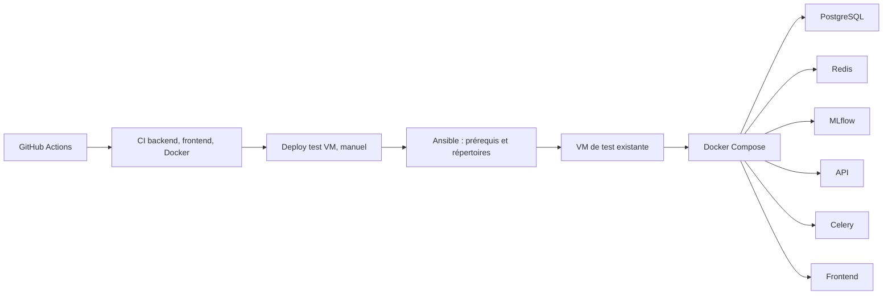
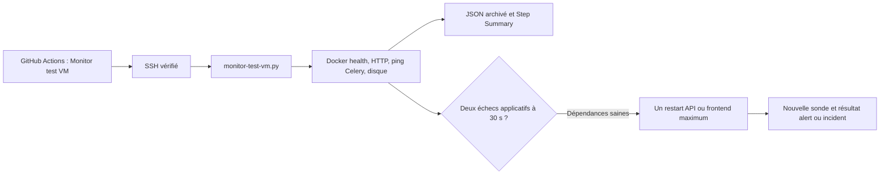

# Runbook de la VM de test existante

Ce document décrit l'exploitation de la VM scolaire **déjà provisionnée**. Il ne contient ni IP publique ni secret. Les commandes de contrôle sont en lecture seule, sauf les opérations explicitement nommées « déploiement » ou « rollback ». Elles ne doivent pas être exécutées pendant une simple consultation des preuves.

## Responsabilités et flux





## Préparer la VM avec Ansible

1. Depuis un environnement disposant d'Ansible (WSL convient), définir localement `TEST_HOST` avec l'adresse **actuelle**, `TEST_USER` et `SSH_KEY_PATH` avec le chemin Linux de la clé privée. Ne jamais les committer ; la clé doit être lisible uniquement par son propriétaire (`chmod 600`).
2. Vérifier indépendamment l'empreinte de la clé hôte SSH. Ne pas accepter aveuglément une nouvelle clé hôte.
3. Lancer le playbook :

   ```bash
   ANSIBLE_HOST_KEY_CHECKING=True ansible-playbook \
     -i "$TEST_HOST," -u "$TEST_USER" \
     --private-key "$SSH_KEY_PATH" deploy/prepare-test-vm.yml
   ```

Le [playbook](../deploy/prepare-test-vm.yml) vérifie Docker et Compose, puis crée `~/satisfaction-test`, `releases` et `shared` avec les permissions prévues. Il ne provisionne pas la VM, n'installe pas Docker et ne touche pas à MicroK8s. Un second passage doit produire `changed=0` ; voir [la preuve](DEVOPS_EVIDENCE.md).

## Secrets GitHub et IP dynamique

L'environnement GitHub `test` nécessite `TEST_HOST`, `TEST_USER`, `TEST_SSH_KEY`, `TEST_SSH_KNOWN_HOSTS` et `TEST_ENV_FILE` pour le déploiement. Le workflow de supervision réutilise les quatre premiers et ne lit pas `TEST_ENV_FILE`. Seuls les **noms** de ces secrets figurent dans le dépôt ; ne jamais copier leur valeur dans un ticket, un log ou un document.

Après un changement d'IP publique de la VM scolaire, relever la nouvelle adresse auprès de l'environnement scolaire, vérifier la nouvelle clé hôte par un canal indépendant, puis mettre à jour **ensemble** `TEST_HOST` et `TEST_SSH_KNOWN_HOSTS` dans l'environnement GitHub `test`. Une clé hôte inattendue ne doit pas être supprimée ou acceptée sans vérification. Le dépôt ne doit contenir aucune IP publique de cette VM.

Le fichier de configuration applicative est transféré hors Git vers `~/satisfaction-test/shared/test.env` en mode `600` par [deploy-test.yml](../.github/workflows/deploy-test.yml). Le redémarrage d'une base PostgreSQL existante avec un nouveau mot de passe dans ce fichier ne modifie pas le mot de passe stocké dans le volume initial.

## Déployer une révision et vérifier ce qui est servi

1. Vérifier que la CI du SHA de `main` est verte.
2. Lancer **manuellement** `Deploy test VM` sur `main` dans GitHub Actions. Le workflow vérifie le SHA exact, exécute Ansible, transfère une archive Git, construit et démarre Compose, puis attend API et frontend. Le déploiement n'est annoncé comme réussi qu'après ses healthchecks.
3. Lire le Step Summary du run et comparer le SHA demandé au SHA déployé.
4. Sur une session SSH déjà vérifiée, effectuer les contrôles en lecture seule :

   ```bash
   cd "$HOME/satisfaction-test"
   cat current.sha
   test -f previous.sha && cat previous.sha
   docker ps --filter 'label=com.docker.compose.project=satisfaction-test'
   curl --fail --silent http://127.0.0.1:8000/health
   curl --fail --silent --output /dev/null http://127.0.0.1:5173/
   df -h /
   ```

`current.sha` est la version réellement servie ; elle peut différer du dernier commit `main` après un rollback. `/health` contrôle l'accès PostgreSQL de l'API. Les healthchecks Compose contrôlent séparément PostgreSQL, Redis, MLflow, API et frontend. Un conteneur Celery simplement `running` n'est pas une preuve fonctionnelle : la sonde utilise aussi `celery inspect ping`.

## Consulter l'application via tunnel

Les ports applicatifs sont liés au loopback de la VM. Depuis le poste de travail, avec `TEST_HOST`, `TEST_USER` et `SSH_KEY_PATH` définis localement :

```bash
ssh -i "$SSH_KEY_PATH" \
  -L 5173:127.0.0.1:5173 \
  -L 8000:127.0.0.1:8000 \
  -L 5000:127.0.0.1:5000 \
  "$TEST_USER@$TEST_HOST"
```

Ouvrir ensuite le frontend, l'API et MLflow sur les ports `localhost` correspondants. Le tunnel ne rend pas ces services publics.

## Rollback applicatif manuel

Vérifier d'abord `current.sha`, `previous.sha`, la compatibilité de l'ancien code avec le schéma DB courant et la disponibilité d'une sauvegarde appropriée. Depuis la VM, le mécanisme prévu est :

```bash
cd "$HOME/satisfaction-test"
current=$(cat current.sha)
bash "releases/$current/deploy/test-deploy.sh" rollback
cat current.sha
cat previous.sha
curl --fail --silent http://127.0.0.1:8000/health
```

Le script réactive la révision précédente et réévalue API et frontend. Il ne réalise **aucun downgrade Alembic** et ne restaure pas PostgreSQL. Le rollback manuel de [la preuve](DEVOPS_EVIDENCE.md) portait sur un second commit vide ; ne pas le présenter comme validation d'un retour entre fonctionnalités différentes.

## Superviser et réagir aux alertes

Le workflow [Monitor test VM](../.github/workflows/monitor-test.yml) peut être lancé manuellement dans GitHub Actions. Son Step Summary et son artefact `monitor-report.json` donnent l'heure, `current.sha`, l'état de chaque composant, HTTP, ping Celery, disque, alerte et remédiation. Le premier [run réel](https://github.com/PiKwaii93/satisfaction-scraper/actions/runs/35726582579) était sain. Le cron est **temporairement** à cinq minutes pour diagnostiquer le scheduler ; aucun run `schedule` n'était observé au contrôle du 22/09/2026. `TEST_MONITOR_SCHEDULE_ENABLED` est déclaré à `false` pendant ce diagnostic : un événement planifié éventuel reste `skipped` tant que la variable n'est pas explicitement à `true`.

Deux échecs applicatifs espacés de 30 secondes autorisent au plus **un** restart de `api` ou `frontend` si leurs dépendances sont saines ; une troisième sonde est archivée. Un incident récupéré reste `alert`. Aucune remédiation automatique n'est prévue pour SSH, disque, PostgreSQL, Redis, MLflow ou Celery. Le ping Celery prouve seulement que le worker répond à l'instant du contrôle.

Si le rapport indique un **échec SSH**, vérifier d'abord que la VM est démarrée, puis l'adresse actuelle, l'accès réseau et la clé hôte vérifiée. Une VM arrêtée ou inaccessible donne volontairement un incident SSH ; ne pas redémarrer ni reconfigurer la VM par automatisme. Si le disque libre descend sous **5 GiB**, l'alerte est informative : relever `df -h /` et `docker system df`, identifier la source de consommation et convenir d'une action manuelle compatible avec les ressources scolaires. Aucune purge automatique.

## Actions interdites sur la VM scolaire

- Pas de `docker system prune` automatique, ni de `docker compose down -v`.
- Pas de suppression de volumes, d'anciens conteneurs ou d'images scolaires.
- Pas de modification de MicroK8s.
- Pas de restauration de base ou de downgrade de migration automatique.
- Pas de redémarrage global de la VM comme remédiation automatique.

Voir [TRACEABILITY.md](TRACEABILITY.md) pour l'état des exigences et [DEVOPS_EVIDENCE.md](DEVOPS_EVIDENCE.md) pour les runs et les limites de preuve.
